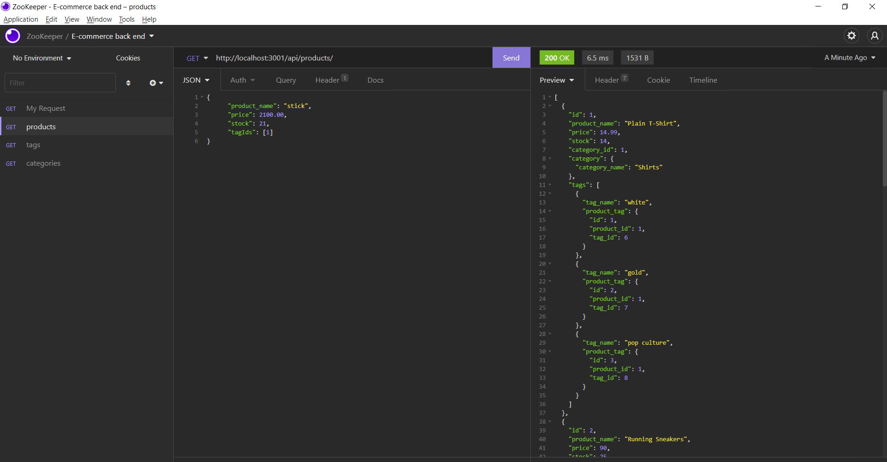

# Apex E-commerce back end.

# Table of Contents

---

[Description](#Description)

[Installations](#Installations)

[Test](#Test)

[Video](#Video)

[Questions](#Questions)

# Description

Project to view a list of products and being able to filter through various categories and ids. While having the functionality to 
create, read, update and delete. 

# Installation

   dotenv, express, sequelize, mysql2

# Test

    source db/schema, run seed, npm start

# Video

https://watch.screencastify.com/v/CA2NbsS2Ay4jdTykwYId

# Questions

---

## Contact me here:

## Author

     Roberto Gasparin

## [Github](https://github.com/box-monkey)

## [Email](mailto:jr.gasparin15@gmail.com)

#

